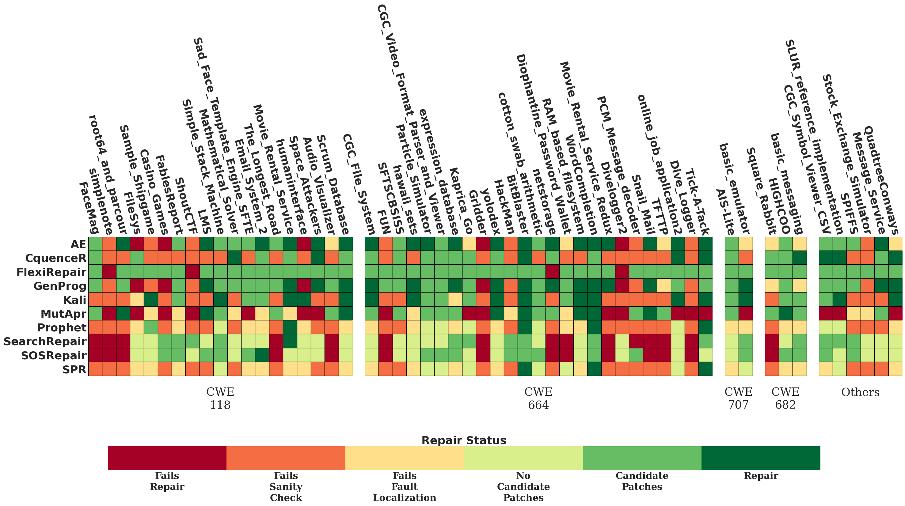
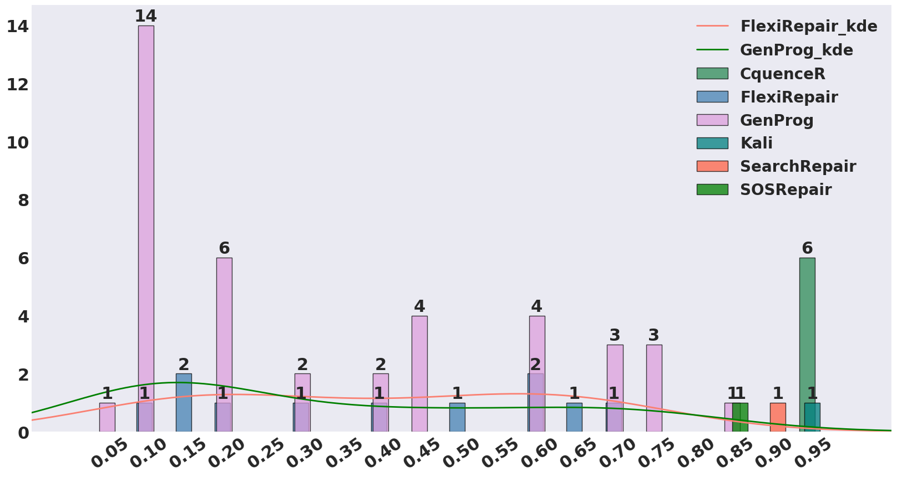
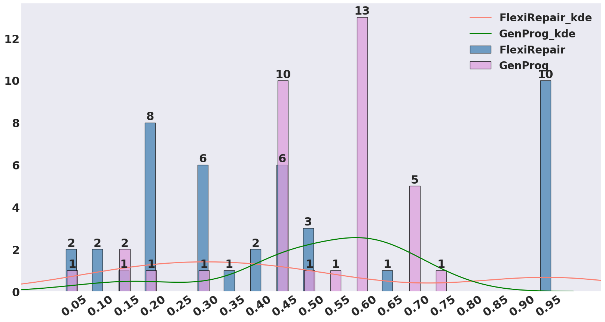
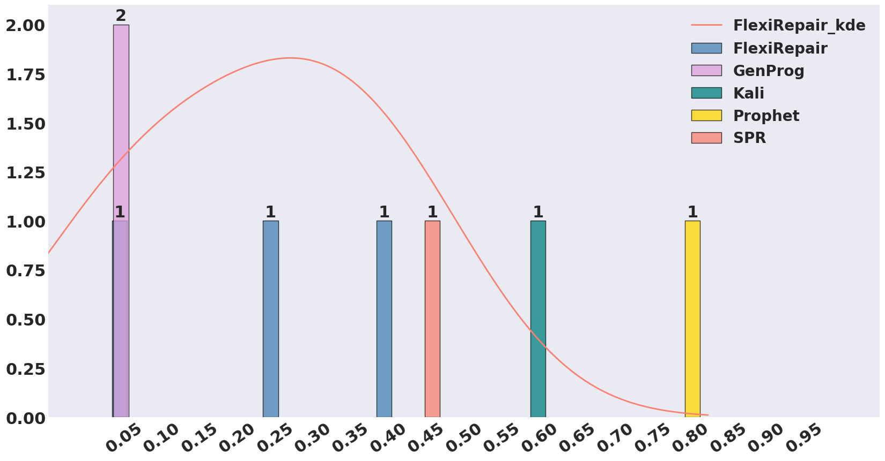
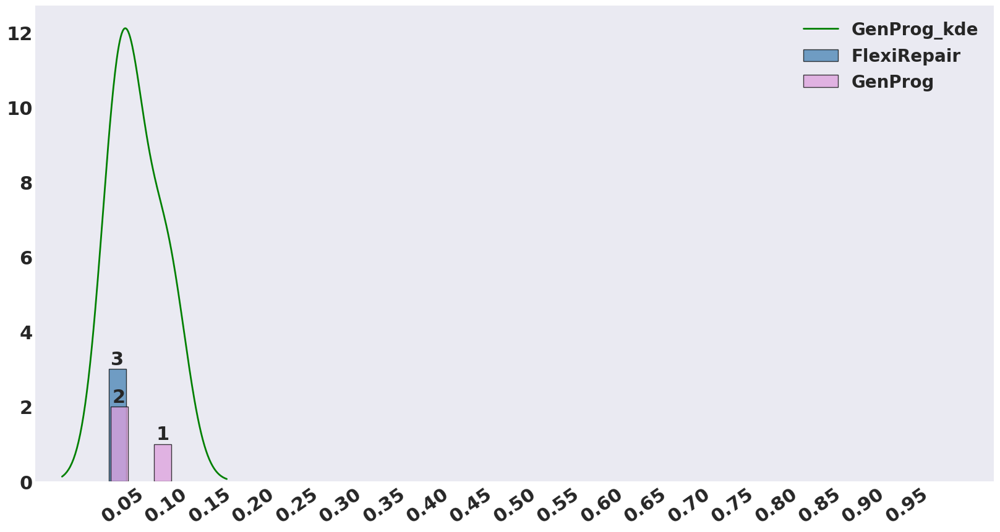
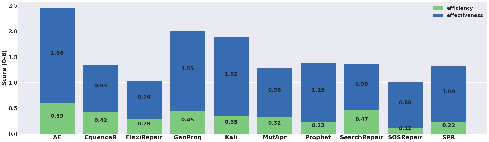
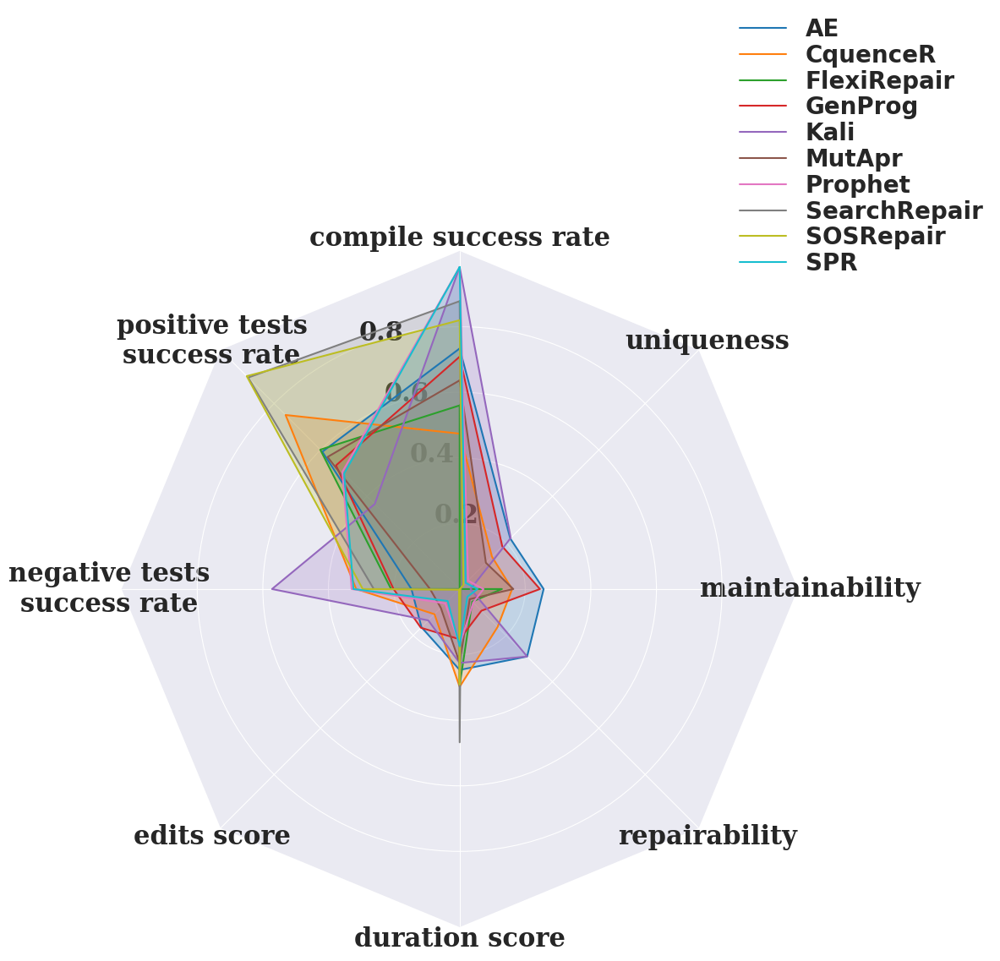

### Tools' repair performance per top CWE along with total execution time
Number of positive tests per program: 20 | Tool timeout: 3600s | 8 threads for executing tools in parallel

|    Tool    | Execution Time | CWE-664       |  CWE-118 | CWE-682  | CWE-707 | Others*  |
 ------------| :------------: | :-----------: | :------: | :------: | :-----: | --------:|
|AE          | 3h49m          |  13 (54\%)    | 6 (32\%) | 0        | 0       | 1 (17\%) | 
|CquenceR    | 2h             |  3  (12.5\%)  | 2 (11\%) | 1 (33\%) | 0       | 3 (50\%) |
|FlexiRepair | 31h43m         |  0            | 0        | 0        | 0       | 0        | 
|GenProg     | 9h17m          |  10 (41.67\%) | 4 (21\%) | 0        | 1 (50%) | 2 (33\%) |  
|Kali        | 13h47m *       |  8 (33\%)     | 5 (26\%) | 0        | 1 (50%) | 2 (33\%) | 
|MUT-APR     | 2h38m          |  5 (20.83\%)  | 3 (16\%) | 1 (33\%) | 0       |  0       | 
|Prophet     | 4h01m *        |  3  (12.50\%) | 1  (5\%) | 0        | 0       |  0       | 
|SearchRepair| 11h13m *       |  0            | 1  (5\%) | 0        | 0       |  0       | 
|SOSRepair   | 15h52m *       |  0            | 1  (5\%) | 0        | 0       |  0       | 
|SPR         | 3h16m *        |  3 (12.5)     | 0        | 0        | 0       |  0       | 
-------------------------------------------------------------------------------------
\$ CWE-697,CWE-284,CWE-388,CWE-710,CWE-690

\* Programs were executed sequentially

## Tools’ capability to repair security vulnerabilities: 

The repair status for each repair attempt is one of the following: 
1) **Fails Repair** if the tool fails to execute;
2) **Fails Sanity** Check if the sanity check fails positive tests or pass negative tests on the original program;
3) **Fails Fault Localization** if the sanity checks fail after instrumentation to collect info (code coverage) to perform fault localization;
4) **No Candidate Patches** if the tool does not generate candidate patches;
5) **Candidate Patches** if the tool generates candidate patches that do not fix the vulnerability;
6) **Repair** if the proposed patch passes all the tests.

### All results for the benchmark's 57 programs 

## Tool's maintainability: 
The maintainability is the percentage of passing positive tests for considering all negative tests pass.

### CWE-118

### CWE-664

### CWE-682

### CWE-707

### Repair tools' performance

### Radio chart showing the repair capabilities of the tools

